# MedFlow v4.0

### AI Governance Framework for Healthcare Insurance Decisions

 

 

**Lead Architect:** Dr. Islam Mekawy, MSc, CPHIMS, CCDS, FLMI, Certified ISO 42001 Lead Implementer (AIMS)
**Patent Status:** SAIP Application Pending &nbsp;·&nbsp; **Jurisdiction:** Kingdom of Saudi Arabia

---

## 📋 Executive Summary

MedFlow v4.0 is a sovereign clinical decision support system engineered for healthcare insurance prior-authorization in Saudi Arabia. It processes inpatient medical records, enforces Saudi Ministry of Health (MOH) clinical protocols, and delivers audit-ready coverage decisions with complete regulatory traceability across PDPL, NPHIES, and ISO 42001 frameworks.

The system addresses the central governance challenge in AI-assisted healthcare decisions: producing recommendations that are clinically sound, legally defensible, and free of algorithmic bias — in a jurisdiction with specific data sovereignty requirements.

---

## 🏛️ Strategic Framework

<table>
<tr>
<td width="33%" valign="top">

### 🌐 &nbsp;Knowledge Sovereignty

Saudi MOH protocols are prioritized at **three times** the retrieval weight of international guidelines. Clinical evidence hierarchy is enforced at the algorithm level, not merely at the policy level. All retrieval operates on on-premises local embeddings — no patient context reaches external infrastructure.

</td>
<td width="33%" valign="top">

### 🔐 &nbsp;Privacy by Architecture

Protected Health Information is eliminated locally before any data leaves the network. Named entities are extracted on-device via a locally-hosted language model. Structured identifiers including National ID, IQAMA, MRN, and date of birth are processed with a downstream validation pass confirming zero residual leakage. No patient data reaches cloud APIs at any stage.

</td>
<td width="33%" valign="top">

### 🛡️ &nbsp;Preemptive NPHIES Compliance

Before any coverage decision is issued, a six-element documentation quality gate screens against NPHIES 960Z rejection criteria. Cases missing primary diagnosis codes, medication dosages, laboratory results, or radiology interpretations are flagged — preventing submission before payer rejection. Quality control shifts from reactive denial management to proactive documentation assurance.

</td>
</tr>
</table>

---

## ⚙️ Architecture: Six-Layer Governance Defense

```mermaid
flowchart TD
    INPUT(["📄  INPUT — Inpatient Medical Records<br/>PDF · DOCX · JSON · Multi-day Clinical Episodes"])

    L1["🔐  LAYER 1 — PRIVACY ELIMINATION<br/>Dual-method PHI scrubbing · Regex + Local LLM<br/>Validation pass confirms zero leakage"]

    L2["📚  LAYER 2 — KNOWLEDGE RETRIEVAL<br/>Semantic RAG · 9,296 indexed knowledge chunks<br/>Saudi MOH at 3× weight · Population filtering"]

    L3["⚖️  LAYER 3 — EVIDENCE SCORING<br/>NCEBM 6-dimension quality assessment<br/>Below-threshold sources rejected at ingestion"]

    L4["🧠  LAYER 4 — CLINICAL ANALYSIS<br/>1M-token full context · No truncation<br/>5-tier confidence calibration · DRG context injection"]

    L5["🏥  LAYER 5 — DRG CLASSIFICATION<br/>Saudi AR-DRG v9.0 · 25 Major Diagnostic Categories<br/>Upcoding risk detection · 960Z documentation gate"]

    L6["📋  LAYER 6 — GOVERNANCE AUDIT<br/>Per-layer structured audit trail · Patent confidence formula<br/>PDPL · NPHIES · ISO 42001 compliance status"]

    OUTPUT(["✅  OUTPUT — Structured Decision Record<br/>Recommendation · Confidence Score · DRG Classification<br/>Full Audit Trail · Regulatory Compliance Status"])

    INPUT --> L1 --> L2 --> L3 --> L4 --> L5 --> L6 --> OUTPUT

    style INPUT  fill:#1c2833,stroke:#3498db,color:#d6eaf8
    style L1     fill:#7b241c,stroke:#e74c3c,color:#fdfefe
    style L2     fill:#1a5276,stroke:#5dade2,color:#fdfefe
    style L3     fill:#4a235a,stroke:#a569bd,color:#fdfefe
    style L4     fill:#145a32,stroke:#2ecc71,color:#fdfefe
    style L5     fill:#7e5109,stroke:#f0b27a,color:#fdfefe
    style L6     fill:#1f4e79,stroke:#7fb3d3,color:#fdfefe
    style OUTPUT fill:#0b3d0b,stroke:#27ae60,color:#d5f5e3
```

---

## 📡 Real-Time Governance Monitoring

The system maintains a continuous model performance monitor that subscribes to every decision event in real time. Two independent drift signals are tracked simultaneously:

- **Signal 1 — Confidence Distribution:** Rolling window vs. baseline confidence score spread
- **Signal 2 — Recommendation Distribution:** Shift in approval / extension / discharge ratios

A variance exceeding 10% in either signal triggers a governance alert — enabling early detection of model degradation without waiting for downstream clinical outcomes or payer feedback.

---

## 🏆 ISO 42001 Compliance

Developed as a primary ISO 42001 Lead Implementer demonstration project. All development activity is documented to ISO 42001 evidence standards with a complete artifact trail.

 

| Compliance Metric | Status |
|:-----------------:|:------:|
| Controls Implemented |  |
| Internal Audit Result |  |
| Risk Assessment |  |
| Algorithmic Fairness |  |
| Regulatory Alignment |    |

---

## 📁 Governance Documentation

| Document | Version | Status |
|----------|:-------:|--------|
| [Statement of Applicability](iso42001-artifacts/Statement_of_Applicability.md) | v1.0 | Current |
| [AI Risk Register](iso42001-artifacts/AI_Risk_Register.md) | v5.1 | 16 risks documented |
| [Internal Audit Report](iso42001-artifacts/Internal_Audit_Report.md) | v1.5 | Conformance confirmed |
| [ISO Compliance Matrix](iso42001-artifacts/ISO_COMPLIANCE_MATRIX.md) | v1.5 | 39/39 controls implemented |
| [Algorithmic Fairness Report](iso42001-artifacts/Algorithmic_Fairness_Report.md) | v1.0 | All metrics pass |
| [Implementation Experience Log](iso42001-artifacts/Implementation_Experience_Log.md) | v2.0 | Full development audit record |
| [Management Review Minutes](iso42001-artifacts/Management_Review_Minutes.md) | v1.4 | Q1 2026 |
| [Continual Improvement Log](iso42001-artifacts/Continual_Improvement_Log.md) | v1.5 | 15 improvements documented |
| [Competence Assessment Matrix](iso42001-artifacts/Competence_Assessment_Matrix.md) | v1.3 | Current |
| [Algorithmic Impact Assessment](iso42001-artifacts/Algorithmic_Impact_Assessment.md) | v1.0 | Patient Safety |
| [Verification & Validation Plan](iso42001-artifacts/Verification_Validation_Plan.md) | v1.0 | Current |
| [AI Data Policy](iso42001-artifacts/AI_Data_Policy.md) | v1.0 | PDPL Aligned |

---

## ⚖️ Algorithmic Fairness

Independent counterfactual fairness validation per ISO 42001 Clause 8.2. Clinical inputs held constant while demographic variables — gender and age cohort — were independently varied to isolate any differential treatment effect.

 

| Fairness Metric | Acceptable Threshold | Observed Variance | Result |
|:--------------:|:--------------------:|:-----------------:|:------:|
| Demographic Parity | < 10% | 0.00% |  |
| Calibration Parity | < 5% | 0.00% |  |
| Review Level Parity | < 10% | 0.00% |  |
| Equal Opportunity | < 15% | 0.00% |  |

 

Full methodology and evidence: [Algorithmic Fairness Report](iso42001-artifacts/Algorithmic_Fairness_Report.md)

---

## 🔬 Data Integrity Statement

All patient data used in development, testing, and validation is synthetically generated. The system's Clinical Simulation Engine produces clinically realistic but entirely fictitious patient cases using arc-based vital sign trajectories, laboratory kinetics models, and medication state machines. No real patient records were used at any stage of development or validation.

This design ensures full compliance with the Saudi Personal Data Protection Law (PDPL) and eliminates all identifiable health information from the research and validation pipeline.

---

## 🔒 Intellectual Property

The mathematical weighting logic, 960Z extraction rules, and NCEBM dimension scoring algorithms are subject to an active **SAIP patent application** and are not included in this public repository.

---

## 📬 Contact

**Dr. Islam Mekawy**
MSc · CPHIMS · CCDS · FLMI · Certified ISO 42001 Lead Implementer (AIMS)

*Lead Architect & Principal Researcher · Kingdom of Saudi Arabia*

 

 

*Personal Research Initiative — Kingdom of Saudi Arabia, 2026*

